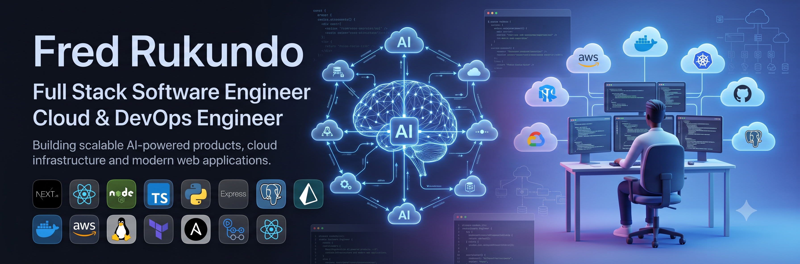

<h1 align="center">Hi 👋 I'm Fred Rukundo</h1>

<h3 align="center">
Full Stack Software Engineer • AI Engineer • Cloud & DevOps Engineer
</h3>

Building intelligent products powered by Artificial Intelligence, Cloud Computing and Modern Web Technologies.

---

# 🚀 About Me

- 💼 Full Stack Software Engineer
- 🤖 AI Product Builder
- ☁️ AWS Cloud Engineer
- 🏗 Technical Lead on AI-powered platforms
- 🎓 1337 Khouribga (42 Network)
- 🌍 Based in Morocco

---

# 🔭 What I'm Working On

- AI-powered SaaS platforms
- Large-scale backend architectures
- Cloud-native infrastructure
- DevOps automation
- Machine Learning integration
- High-performance APIs

---

# 🛠 Tech Stack

## Languages

## Frontend

## Backend

## Databases

## Cloud & DevOps

## Tools

---

# ⭐ Featured Projects

## 🏡 Daba.Dar (Dar AI)

AI-powered Design & Build platform that connects future property owners with architects, engineers and construction professionals through intelligent AI matching.

**Tech**

Next.js • Express • PostgreSQL • Prisma • AWS • AI

---

## 🌱 GrowNet

Tree planting platform enabling organizations to manage environmental campaigns, donations, sponsors, transparency dashboards and project tracking.

**Tech**

React • Express • PostgreSQL • AWS S3

---

## ☁️ Cloud-1

Designed and deployed a highly available cloud infrastructure on AWS using Infrastructure as Code and DevOps best practices.

### Features

- Dockerized services
- AWS EC2
- RDS
- EFS
- Application Load Balancer
- Ansible Automation
- Highly Available Architecture
- Automated Deployment Pipeline

---

## ❤️ Matcha

Modern full-stack dating platform featuring authentication, matching algorithms, messaging, geolocation, notifications and user profiles.

**Tech**

Next.js

Express

PostgreSQL

Socket.io

---

## 🎬 Hypertube

Movie streaming platform capable of downloading, transcoding and streaming movies while managing subtitles and user libraries.

**Tech**

Next.js

Express

PostgreSQL

FFmpeg

Streaming APIs

---

## 🏙 Daba.Cities

Community-driven real estate ecosystem bringing together investors, developers, architects and property owners into one intelligent platform.

---

# 📈 Contribution Graph

---

# 🏆 Current Interests

- Artificial Intelligence
- Large Language Models (LLMs)
- Cloud Computing
- Distributed Systems
- DevOps
- Software Architecture
- Geospatial Systems
- Computer Vision

---

# 📫 Connect With Me

📧 **Email**

dukefred9@gmail.com

💼 **LinkedIn**

[Rukundo-fred](https://www.linkedin.com/in/rukundo-fred/)

---

<i>"Building software that solves real-world problems through AI, cloud computing, and scalable engineering."</i>

